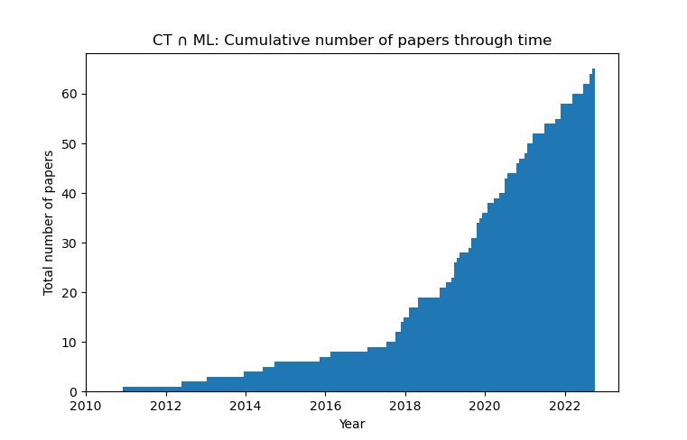

# Category Theory ∩ Machine Learning

Category Theory has been finding increasing applications in machine learning.
This repository aims to list all of the relevant papers, grouped by fields.

There might be papers missing, and some papers are in multiple fields.
Feel free to contribute to this list - preferably by creating a pull request.

### Survey papers
* [Category Theory in Machine Learning](https://arxiv.org/abs/2106.07032)

### Deep Learning
* [Categorical Foundations of Gradient-Based Learning](https://arxiv.org/abs/2103.01931)
* [Backprop as Functor](https://arxiv.org/abs/1711.10455)
* [Lenses and Learners](https://arxiv.org/abs/1903.03671)
* [Reverse Derivative Ascent](https://arxiv.org/abs/2101.10488)
* [Dioptics](http://events.cs.bham.ac.uk/syco/strings3-syco5/papers/dalrymple.pdf)
* [Learning Functors using Gradient Descent](http://www.cs.ox.ac.uk/ACT2019/preproceedings/Bruno%20Gavranovic.pdf) (longer version [here](https://arxiv.org/abs/1907.08292))
* [Compositionality for Recursive Neural Networks](https://arxiv.org/abs/1901.10723)
* [Deep neural networks as nested dynamical systems](https://arxiv.org/abs/2111.01297)
* [Neural network layers as parametric spans](https://arxiv.org/abs/2208.00809)
* [Categories of Differentiable Polynomial Circuits for Machine Learning](https://arxiv.org/abs/2203.06430)

### Differentiable programming / automatic differentiation
* [Differentiable Causal Computations via Delayed Trace](https://arxiv.org/abs/1903.01093)
* [Simple Essence of Automatic Differentiation](https://arxiv.org/abs/1804.00746)
* [Reverse Derivative Categories](https://arxiv.org/abs/1910.07065)
* [Towards formalizing and extending differential programming using tangent categories](http://www.cs.ox.ac.uk/ACT2019/preproceedings/Jonathan%20Gallagher,%20Geoff%20Cruttwell%20and%20Ben%20MacAdam.pdf)
* [Correctness of Automatic Differentiation via Diffeologies and Categorical Gluing](https://arxiv.org/abs/2001.02209)
* [Space-time tradeoffs of lenses and optics via higher category theory](https://arxiv.org/abs/2209.09351)

### Probability theory
* [Markov categories](https://arxiv.org/abs/1908.07021)
* [Infinite products and zero-one laws in categorical probability](https://arxiv.org/abs/1912.02769)
* [A Convenient Category for Higher-Order Probability Theory](https://arxiv.org/abs/1701.02547)
* [Bimonoidal Structure of Probability Monads](https://arxiv.org/abs/1804.03527)
* [Representable Markov Categories and Comparison of Statistical Experiments in Categorical Probability](https://arxiv.org/abs/2010.07416)
* [De Finneti's construction as a categorical limit](https://arxiv.org/abs/2003.01964)
* [A Probability Monad as the Colimit of Spaces of Finite Samples](https://arxiv.org/abs/1712.05363)
* [A Probabilistic Dependent Type System based on Non-Deterministic Beta Reduction](https://arxiv.org/abs/1602.06420)
* [Probability, valuations, hyperspace: Three monads on Top and the support as a morphism](https://arxiv.org/abs/1910.03752)
* [Categorical Probability Theory](https://arxiv.org/abs/1406.6030)
* [Information structures and their cohomology](https://arxiv.org/abs/1709.07807)
* [Computable Stochastic Processes](https://arxiv.org/abs/1409.4667)
* [Compositional Semantics for Probabilistic Programs with Exact Conditioning](https://arxiv.org/abs/2101.11351)

### Bayesian/Causal inference
* [A category theory framework for Bayesian Learning](https://arxiv.org/abs/2111.14293)
* [Causal Theories: A Categorical Perspective on Bayesian Networks](https://arxiv.org/abs/1301.6201)
* [Bayesian machine learning via category theory](https://arxiv.org/abs/1312.1445)
* [A Categorical Foundation for Bayesian probability](https://arxiv.org/abs/1205.1488)
* [Bayesian Open Games](https://arxiv.org/abs/1910.03656)
* [Causal Inference by String Diagram Surgery](https://arxiv.org/abs/1811.08338)
* [Disintegration and Bayesian Inversion via String Diagrams](https://arxiv.org/abs/1709.00322)
* [Categorical Stochastic Processes and Likelihood](https://arxiv.org/abs/2005.04735)
* [Bayesian Updates Compose Optically](https://arxiv.org/abs/2006.01631)
* [Automatic Backward Filtering Forward Guiding for Markov processes and graphical models](https://arxiv.org/abs/2010.03509)
* [A Channel-Based Perspective on Conjugate Priors](https://arxiv.org/abs/1707.00269)
* [A Type Theory for Probabilistic and Bayesian Reasoning](https://arxiv.org/abs/1511.09230)
* [Denotational validation of higher-order Bayesian inference](https://arxiv.org/abs/1711.03219)
* [The Geometry of Bayesian Programming](https://arxiv.org/abs/1904.07425)
* [Relational Reasoning for Markov Chains in a Probabilistic Guarded Lambda Calculus](https://arxiv.org/abs/1802.09787)

### Topological Data Analysis
* [On Characterizing the Capacity of Neural Networks using Algebraic Topology](https://arxiv.org/abs/1802.04443)
* [Persistent-Homology-based Machine Learning and its Applications - A Survey](https://arxiv.org/abs/1811.00252)
* [Topological Expressiveness of Neural Networks](https://run.unl.pt/bitstream/10362/129615/1/TAA0115.pdf)

### Metric space magnitude
* [Approximating the convex hull via metric space magnitude](https://arxiv.org/abs/1908.02692)
* [Practical applications of metric space magnitude and weighting vectors](https://arxiv.org/abs/2006.14063)
* [Weighting vectors for machine learning: numerical harmonic analysis applied to boundary detection](https://arxiv.org/abs/2106.00827)
* [The magnitude vector of images](https://arxiv.org/abs/2110.15188)

### Blog posts
* [Neural Networks, Types, and Functional Programming](https://colah.github.io/posts/2015-09-NN-Types-FP/)
* [Towards Categorical Foundations of Learning](https://www.brunogavranovic.com/posts/2021-03-03-Towards-Categorical-Foundations-Of-Neural-Networks.html)

### Automata Learning
* [Automata Learning: A Categorical Perspective](http://www.calf-project.org/publications/prakash.pdf)
* [A Categorical Framework for Learning Generalised Tree Automata](https://arxiv.org/abs/2001.05786)

### Misc
* [Graph Neural Networks are Dynamic Programmers](https://arxiv.org/abs/2203.15544)
* [Generalized Convolution and Efficient Language Recognition](https://arxiv.org/abs/1903.10677)
* [General supervised learning as change propagation with delta lenses](https://arxiv.org/abs/1911.12904)
* [From Open Learners to Open Games](https://arxiv.org/abs/1902.08666)
* [Learners Languages](https://arxiv.org/abs/2103.01189)
* [A Constructive, Type-Theoretic Approach to Regression via Global Optimisation](https://arxiv.org/abs/2006.12868)
* [Natural Graph Networks](https://arxiv.org/abs/2007.08349)
* [Local Permutation Equivariance For Graph Neural Networks](https://arxiv.org/abs/2111.11840)
* [Characterizing the invariances of learning algorithms using category theory](https://arxiv.org/abs/1905.02072)
* [Functorial Manifold Learning](https://arxiv.org/abs/2011.07435)
* [Sheaf Neural Networks](https://arxiv.org/abs/2012.06333)
* [Neural Sheaf Diffusion: A Topological Perspective on Heterophily and Oversmoothing in GNNs](https://arxiv.org/abs/2202.04579)
* [Sheaf Neural Networks with Connection Laplacians](https://arxiv.org/abs/2206.08702)
* [Diegetic representation of feedback in open games](https://arxiv.org/abs/2206.12338)
* [Assessing the Unitary RNN as an End-to-End Compositional Model of Syntax](https://arxiv.org/abs/2208.05719)
* [Classifying Clustering Schemes](https://arxiv.org/abs/1011.5270)
